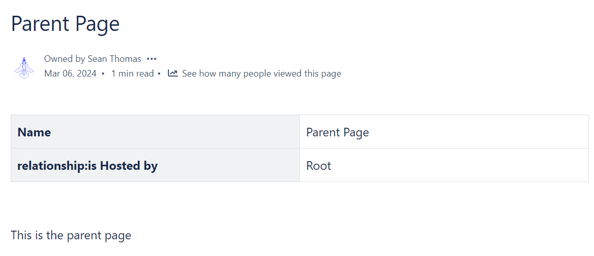

## Sample app for loading data from Confluence and turning it into a chart


## What this is?

This will render a Dependencies graph for pages (Confluence Page), as per the table defined in page-properties 

## How this works (High level)


### Want to replicate?

#### Create 5 pages

##### Page Index


> Get the PageId for this page

##### Page Parent



> Add Page Properties with a Table

##### Child Page 1


> Add Page Propertiies with a relationship to the parent page

##### Child Page 2


##### Chart Page


> Edit the [index.html](index.html) 
```
<script>
    window.contentId = "replace-me-with-index-page-id";
</script>
```

> run `yarn build`

> Upload the [Built file as attachment](dist/index.html)

> Add the Html Content Block

> Edit Html Content block settings

> Select Render Method: Attachment

> Select the attachment


## Debug

```
yarn debug --open
```

## Build

```
yarn build
```

Then copy the /dist/index.html as attachment into confluence
